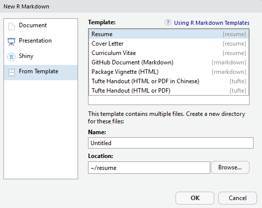
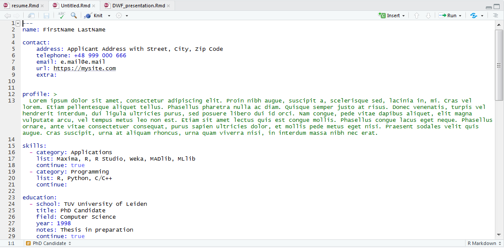
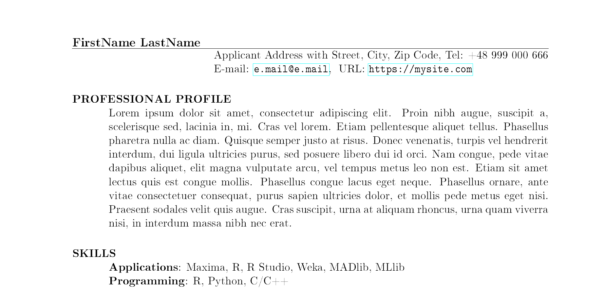

# Resume R Markdown Templates

```{r echo=FALSE, results="hide", message=FALSE, warning=FALSE}
library("badger")
```

```{r, echo = FALSE, results='asis'}
cat(
	badge_cran_release("resume", "green"),
	badge_cran_download("resume", "grand-total", "green"),
	badge_cran_download("resume", "last-month", "green"),
	badge_cran_download("resume", "last-week", "green")
)
```


The `resume` library helps you to create your dream job application documents. My main motivation was to learn how to write R libraries and show it off in my own résumé. Now I want to share it with others.

## Installation

You can install this from Github via the `devtools` package:

```r
devtools::install_github("jacekpardyak/resume")
```

## Usage

The easiest way to use my templates is within Rstudio. Go to *File > New File > R Markdown*. Here, select any template you'd like to use.

```{r, echo=FALSE, out.width = "750px", fig.align="center"}

```


The development version includes the following templates:

- **Resume**: template for more classic, subdued style résumé. Appropriate when you are applying to companies with a more traditional feel.
- **Curriculum Vitae**: template for more flair two column résumé with some graphics. Appropriate when you are applying to companies with more of a start-up vibe.
- **Cover Letter**: template using standard document class `letter` with date, address and hand signature. This letter usually accompanies your job application.

Next step is to modify the new created **R Markdown** document:

```{r, echo=FALSE, out.width = "750px", fig.align="center"}

```


Finally use the **Knit** button to produce document like this:

```{r, echo=FALSE, out.width = "750px", fig.align="center"}

```


## Possible problems

If MiKTex generates errors, compile *.tex files in TeXworks once to install the missing dependencies.
