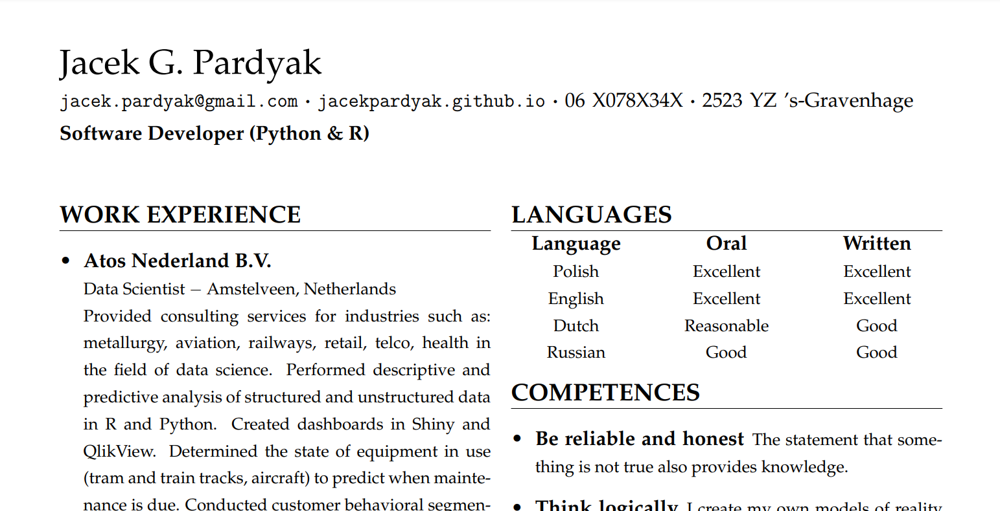

# Resume R Markdown Templates

[](https://cran.r-project.org/package=resume)
[](https://cran.r-project.org/package=resume)
[](https://cran.r-project.org/package=resume)
[](https://cran.r-project.org/package=resume)


The `resume` library helps you to create your dream job application
documents. My main motivation was to learn how to write R libraries and
show it off in my own résumé. Now I want to share it with others.

## Installation

You can install this from Github via the `devtools` package:

``` r
devtools::install_github("jacekpardyak/resume")
```

## Usage

The easiest way to use my templates is within Rstudio. Go to *File &gt;
New File &gt; R Markdown*. Here, select any template you’d like to use.


This library includes the following templates:

-   **Resume**: template for more classic, subdued style résumé.
    Appropriate when you are applying to companies with a more
    traditional feel.
-   **Curriculum Vitae**: template for more flair two column résumé with
    some graphics. Appropriate when you are applying to companies with
    more of a start-up vibe.
-   **Cover Letter**: template using standard document class `letter`
    with date, address and hand signature. This letter usually
    accompanies your job application.

Next step is to modify the new created **R Markdown** document:


Finally use the **Knit** button to produce document like this:


or like this:



and like this:


## Possible problems

If MiKTex generates errors, compile \*.tex files in TeXworks once to
install the missing dependencies.
