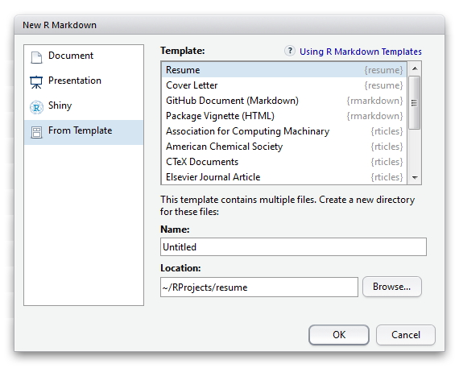
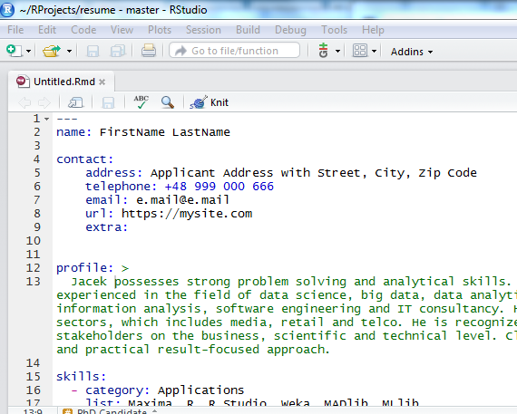
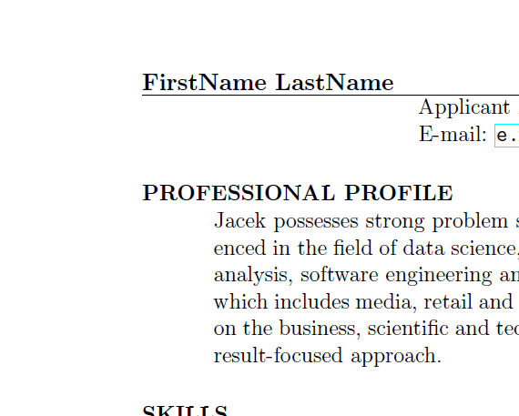

### Overview

The **resume** package provides a suite of custom [R Markdown](http://rmarkdown.rstudio.com) LaTeX formats and templates for authoring resumes and cover letters. 
That documents composition and formatting can be done using lightweight [markdown](http://rmarkdown.rstudio.com/authoring_basics.html) syntax, and R code and its output can be seamlessly included using [knitr](http://yihui.name/knitr/). At the same time, classical pdf output conform precisely to job application submission standards. 

### Using resume from RStudio

To use **resume** from RStudio:

1) Install the latest [RStudio](http://www.rstudio.com/products/rstudio/download/).

2) Install the development version from GitHub:

```r
devtools::install_github("jacekpardyak/resume")
```    

3) Use the **New R Markdown** dialog to create resume or cover letter from appropriate template:

 

4) Modify the new created **R Markdown** document:

 

5) Use the **Knit** button to produce resulting document:

 

### Using rticles outside of RStudio

1) Install [pandoc](http://johnmacfarlane.net/pandoc/) using the [instructions for your platform](https://github.com/rstudio/rmarkdown/blob/master/PANDOC.md).

2) Install the **rmarkdown** and **rticles** packages:

    
    install.packages("rmarkdown")
    devtools::install_github("rstudio/rticles")
    
    
3) Use the `rmarkdown::draft` function to create articles:

    
    rmarkdown::draft("MyJSSArticle.Rmd", template = "jss_article", package = "rticles")
    rmarkdown::draft("MyRJournalArticle", template = "rjournal_article", package = "rticles")
    

