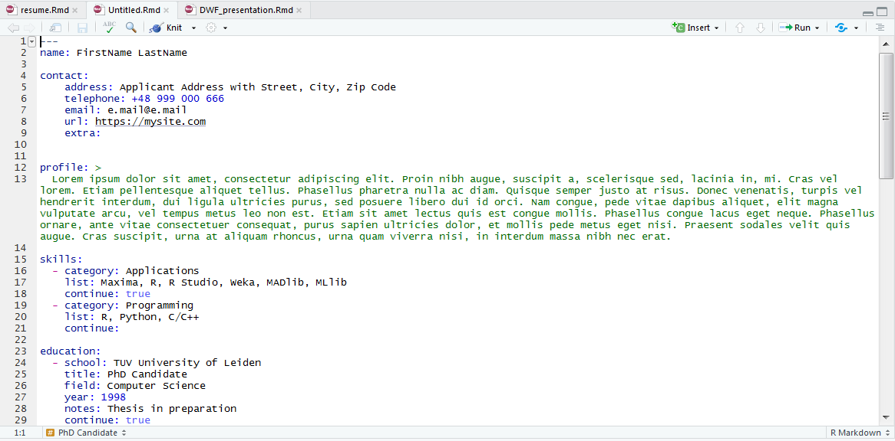

```{r setup, include=FALSE}
library(tufte)
# invalidate cache when the tufte version changes
knitr::opts_chunk$set(tidy = FALSE, cache.extra = packageVersion('tufte'))
options(htmltools.dir.version = FALSE)
```

# Introduction

The **resume**^[<a href="https://github.com/JacekPardyak/resume/" target="_blank">https://github.com/JacekPardyak/resume/</a>] package provides a suite of custom **R Markdown**^[[http://rmarkdown.rstudio.com](http://rmarkdown.rstudio.com)] and $\LaTeX$^[[https://www.latex-project.org/](https://www.latex-project.org/)] formats and templates for authoring resumes and cover letters.  
That documents composition and formatting can be done using lightweight **markdown**^[[http://rmarkdown.rstudio.com/authoring_basics.html](http://rmarkdown.rstudio.com/authoring_basics.html)] syntax, and **R**^[[https://www.r-project.org/](https://www.r-project.org/)] code and its output can be seamlessly included using **knitr**^[[http://yihui.name/knitr/](http://yihui.name/knitr/)]. At the same time, classical **pdf**^[[https://en.wikipedia.org/wiki/PDF](https://en.wikipedia.org/wiki/PDF)] output conform precisely to job application submission standards.


## Using resume package

Start using **resume package** with installation of the latest **RStudio**^[[http://www.rstudio.com/products/rstudio/download/](http://www.rstudio.com/products/rstudio/download/)].

Then install the development version of the package from GitHub using this command.`r newthought('')`^[devtools::install_github("jacekpardyak/resume"]

Next use the **New R Markdown** dialog to create **resume** or **cover letter** from appropriate template:

```{r, echo=FALSE, out.width = "750px", fig.align="center"}
knitr::include_graphics("./man/figures/Capture1.PNG")
```


Next modify the new created **R Markdown** document:

```{r, echo=FALSE, out.width = "750px", fig.align="center"}

```


Finally use the **Knit** button to produce resulting **document**^[[Example of the resulting document](https://raw.githubusercontent.com/JacekPardyak/resume/master/man/figures/Untitled.pdf)]:

```{r, echo=FALSE, out.width = "750px", fig.align="center"}

```


